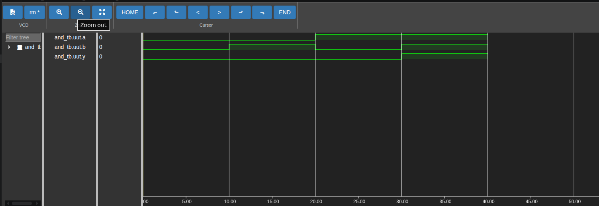

# Digital Design using Verilog

This repository contains Verilog implementations of basic digital logic circuits along with their testbenches and simulation results.

## Project Structure

```
Digital_Design/
├── Basics/
│   └── Logic_Gates/
│       ├── src/
│       │   ├── and_gate.v
│       │   └── or_gate.v
│       ├── testbench/
│       │   ├── and_tb.v
│       │   └── or_tb.v
│       ├── scripts/
│       │   └── and.ys          # Yosys synthesis script
│       ├── reports/
│       │   └── and_gate/
│       │       └── report.txt  # Yosys synthesis report
│       ├── sim/                # Icarus Verilog sim output (.vcd, executables)
│       └── modelsim/           # ModelSim sim output (work lib, .wlf, transcript)
├── img/
│   ├── and_gate.png
│   └── or_gate.png
└── README.md
```

---

## Requirements

Install the following tools:

- Git
- Icarus Verilog (iverilog)
- GTKWave
- Yosys (synthesis)
- ModelSim (simulation)

### Ubuntu

```bash
sudo apt update
sudo apt install iverilog gtkwave yosys git
```

ModelSim isn't in apt; install it from the Intel/Altera (Quartus) or Siemens download page and add its `bin` folder to your `PATH`.

Verify installation:

```bash
iverilog -V
vvp -V
gtkwave --version
yosys -V
vsim -version
```

---

## Clone the Repository

```bash
git clone https://github.com/usa-ma315/Digital-Design.git
cd Digital-Design
```

---

## Compile

```bash
mkdir -p Basics/Logic_Gates/sim
mkdir -p Basics/Logic_Gates/sim/and_gate

iverilog \ -o Basics/Logic_Gates/sim/and_gate Basics/Logic_Gates/src/and_gate.v Basics/Logic_Gates/testbench/and_tb.v
```

---

## Run Simulation

```bash
cd Basics/Logic_Gates/sim/and_gate
vvp and_gate
```

This generates:

```
and_tb.vcd
```

---

## View Waveform

```bash
cd Basics/Logic_Gates/sim/and_gate
gtkwave and_tb.vcd
```

---

## Synthesize with Yosys

Run the synthesis script and save a report:

```bash
cd Basics/Logic_Gates
mkdir -p reports/and_gate
yosys scripts/and.ys | tee reports/and_gate/report.txt
```

`scripts/and.ys` reads the source, sets the top module, runs `synth`, and prints stats (`stat`). Add a `write_verilog` line to the script if you also want a synthesized netlist file.

---

## Simulate with ModelSim

As an alternative (or in addition) to the Icarus + GTKWave flow:

```bash
mkdir -p Basics/Logic_Gates/modelsim/and_gate
cd Basics/Logic_Gates/modelsim/and_gate
vlib work
vlog ../../src/and_gate.v ../../testbench/and_tb.v
vsim -c and_tb -do "run -all; quit"
```

To view waveforms in ModelSim's GUI instead of GTKWave, drop the `-c` flag and add signals to the wave window:

```bash
vsim and_tb
# in the ModelSim console:
add wave -r /*
run -all
```

---

## Expected Truth Table

| A | B | Y |
|---|---|---|
|0|0|0|
|0|1|0|
|1|0|0|
|1|1|1|

---

## Screenshots

### GTKWave Output



---

## Author

Usama